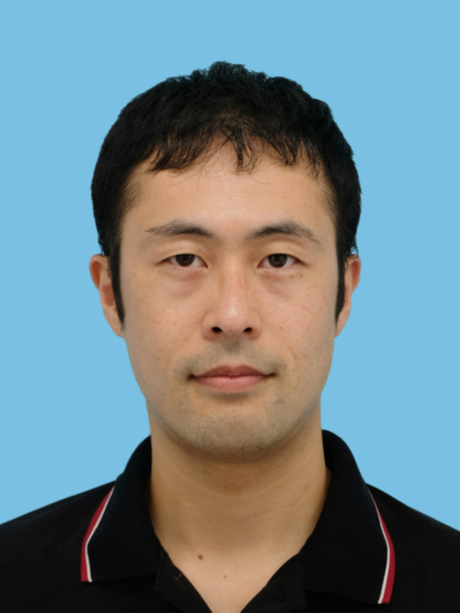

<!--

-->

# Education

* [Japanese](https://researchmap.jp/read0152172/education?lang=ja)
* [English](https://researchmap.jp/read0152172/education?lang=en)

<!--
* 2004.4-2009.3: Department of Applied Physics, University of Tokyo (Master's course: Prof. Takeo Fujiwara, Docter's course: Prof. Masatoshi Imada)
-->

# Employment

* [Japanese](https://researchmap.jp/read0152172/research_experience?lang=ja)
* [English](https://researchmap.jp/read0152172/research_experience?lang=en)

<!--
* 2023.4.1-: Associate professor (Department of Physics, Saitama University)
* 2015.10.1-2023.3.31: Assistant professor (Department of Physics, Saitama University)
* 2013.2.11-2015.9.30: Post doc (ETH)
* 2010.4-2013.2.10: Post doc (Nanosystem Research Institute, National Institute of Advanced Industrial Science and Technology)
* 2009.8-2010.3: Post doc (Institute for Solid State Physics, The University of Tokyo)
* 2009.4-2009.8: Post doc (Department of Applied Physics, The University of Tokyo)
* 2006.4-2009.3: JSPS research fellow
-->