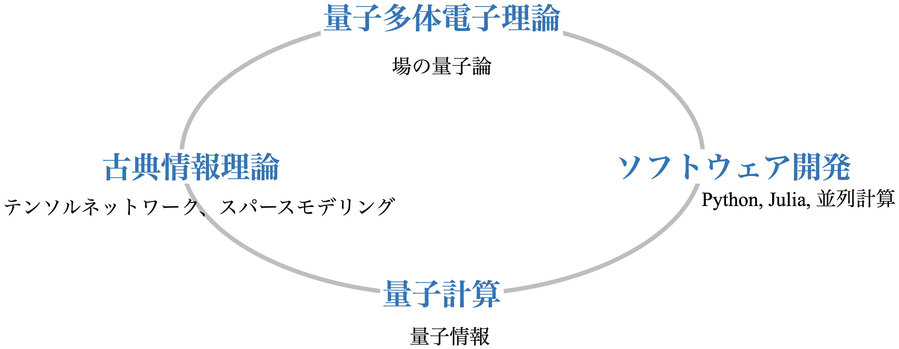

# 研究室を志望される方へ

品岡寛 (2024年5月30日)

当研究室では、古典・量子情報理論と物性理論の融合を目指して日々研究を行っています。
以下では、研究室の研究内容、強み、メンバー、研究室活動についてご紹介します。

## 主な研究内容

### 物性物理と第一原理計算
当研究室では、主に物性理論の研究を行っています。
後述のように、最近では物性理論の枠を超えて研究を展開していますが、
物性物理が本研究室での研究の基盤です。

物性物理の中でも、強相関電子系と呼ばれる物質の研究に興味を持っています。
これらの物質は、電子間のクーロン相互作用が強いため、電子が独立粒子として振る舞うことができません。
その結果、

- 高温超伝導
- 量子磁性体
- モット絶縁体

など (1番目ぐらいは名前を聞いたことあるかもしれませんが)、非自明な物性を示すことがあります。
これらの物質や現象は、将来のエネルギー、環境問題の解決にも重要です。

当研究室では、これらの物質の性質を計算機を使って理解することを目指しています。
このような計算は、基本的な方程式、シュレディンガー方程式、(第一原理)をできるだけ厳密に解くことを目指すことから、「第一原理計算」とよばれることがあります。

学部の量子力学の講義で出てくる問題は、1個の粒子のシュレディンガー方程式を解くことが多いです。
もしくは、多数の粒子が居ても、それぞれの粒子が独立に振る舞うと見なせる系を考えることが多いです。

ただ、多数の電子が集団運動する系 (多体電子系)の厳密な解法は、
電子の数に対して指数関数的な計算量が必要となるため、現実的な時間で解くことができません。
そこで、できるだけ情報を圧縮して、近似を施して計算を行うことが重要です。
将来的には、量子力学的な原理に基づく計算機 (量子コンピュータ)を使って、このような問題を解くことが期待されています。

### 情報圧縮技術と場の量子論の融合を目指して

機械学習を始め、情報技術がさまざまな分野に応用される中、物性物理の研究にも新たな可能性が広がっています。
当研究室では、情報圧縮技術と場の量子論に関して、世界の最先端の研究を牽引しているトップグループの1つです。
場の量子論とは、量子力学の枠組みの一つで、素粒子論や固体物理学などで用いられる理論です。
情報圧縮技術は、データをできるだけ小さな情報量で表現したり、巨大なデータから重要な情報を取り出す技術です。
当研究室では、特に「スパースモデリング」や[「テンソルネットワーク」](https://www.jst.go.jp/pr/announce/20230427-2/index.html)といった情報圧縮技術を用いて、場の量子論計算を効率化する研究を行っています。

### オープンソースソフトウェア開発
開発した計算理論を他の人が簡単に使えるようにすることで、研究の価値を大きく高めることができます。
そのため、C++、PythonやJuliaといったプログラミング言語を使って、研究成果をオープンソースソフトウェアとして公開することを重要視しています。
以下の様なサイトの運営を行っています。

- [sparse-ir tutorial](https://spm-lab.github.io/sparse-ir-tutorial/)
- [Tensor4All](https://tensor4all.github.io/)

## 研究の最先端で活躍するために
当研究室には、複数の強みがあります。

- 情報圧縮＋場の量子論のパイオニアとしての立場
- 国内外の強力な共同研究網
- 計算物理学のソフトウェア開発技術
- 豊富な研究資金

これを生かして、日本の計算物理学を牽引しています。
特に、

* [科研費・学術変革領域B「量子古典融合」(領域代表: 品岡)](https://qc-hybrid.github.io/)
* JST創発的研究支援事業「2粒子レベルの量子埋め込み理論に基づく新規第一原理計算手法の開発と実証」
* JSTさきがけ・量子情報処理「スパースモデリングを用いた固体の革新的量子計算技術の開発」

など、多くの研究資金を取得すると共に、国内外の共同研究網を構築しています。

また、計算物理春の学校 ([2023年3月第1回](https://hohno0223.github.io/comp_phys_spring_school2023/)、[2024年3月第2回](https://compphysspringschool2024.github.io/homepage2024/))の創設・運営にも関わっています!

## 主な共同研究先
### 2023年度実績 (国内)
- 東京大学
- 大阪公立大学
- 理化学研究所
- 京都大学
 
### 2023年度実績 (海外)
- オーストリア: ウィーン工科大学
- スイス: フリブール大学
- ドイツ: LMUミュンヘン
- フランス: CEAグルノーブル
- アメリカ: フラットアイアン研究所 (ニューヨーク)、ミシガン大学
- チェコ: ブルノ大学

### 2023年度招聘実績 (海外)
- ウィーン工科大学
  - 博士課程後期学生1名 2週間滞在
  - 研究員 1週間滞在
 
### 2024年度派遣予定
- 博士研究員1名：3ヶ月@ウィーン、スイス
- 博士課程後期学生1名：2ヶ月＠ウィーン
- 博士課程前期学生1名：3ヶ月＠ウィーン、スイス

## 研究室活動

週数回のセミナー・輪講を中心に研究室活動を行っています。

- 輪講・セミナー
  - B4輪講（週1回、星野研と合同)
  - 物性理論セミナー (週1回、星野研と合同)
  - 研究室打ち合わせ (週1回、各1時間程度)
  - その他の輪講は適宜設定

- 学べること
  - 場の量子論、固体物理、量子情報、など
  - 最先端のプログラミング技術
    - Julia, Python, C++, テスト駆動型開発など

## メンバー

進路: ポスドク＠東大、東大修士進学、高等学校教師、IT企業、東芝等

外部進学希望者も歓迎

## どういう人が向いているか
当研究室では、各自の興味・強みにあった研究を行うことを重視しています。
その一方、特に以下のような方に向いていると考えています。

- 数学や物理の基礎が好きな方
- プログラミングが好き、もしくは身につけたい方
- 国内・国際の共同研究に興味がある方